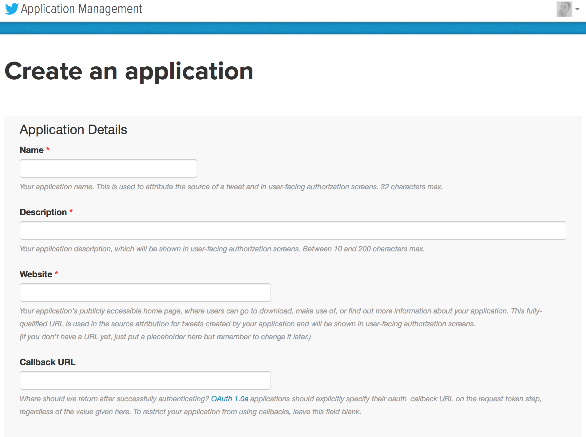
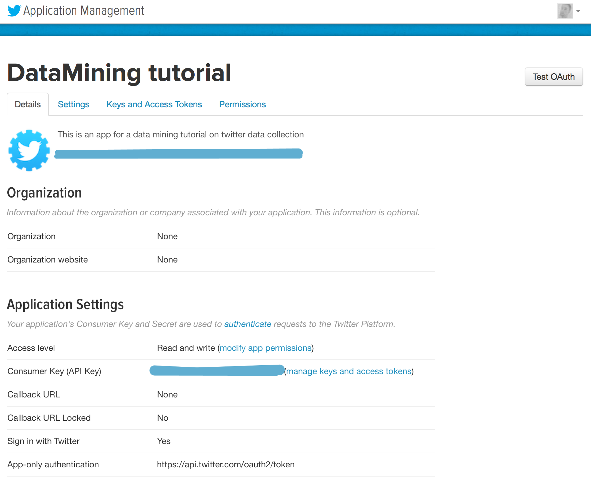
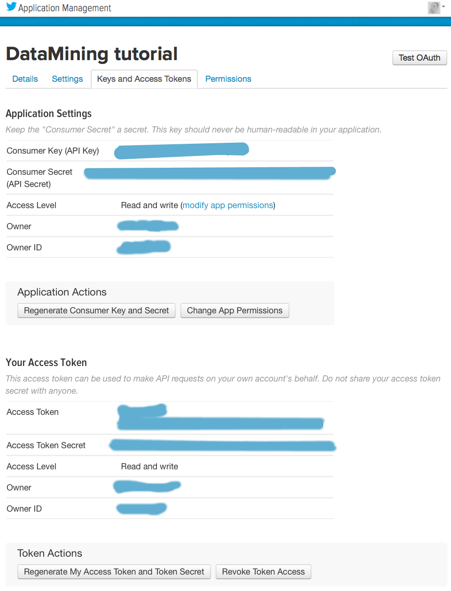

# Streaming tweets

Simple script para utilizar el [**Public Streams API de Twitter**](https://dev.twitter.com/streaming/public) para obtener tweets que contengan ciertas palabras de busqueda.

## Requerimientos

Para obtener los tweets utilizamos la biblioteca [**tweepy**](http://www.tweepy.org/) y para crear el csv utilizamos [**pandas**](http://pandas.pydata.org/).

     $ pip3 install tweepy
     $ pip3 install pandas

## Obtener las credenciales

1- Ir a https://apps.twitter.com/ (logeate si no lo estas) y clickea en *Crear nueva App*.  
2- Completar el *Nombre de la aplicación*, *Descripción* y si *sitio web*. El *URL callback* lo podes dejar en blanco.

3- Acepta los TOS y ya creastes tu aplicación.

4- En la tab *Keys and Acces Tokens* hace click en crear nuevo *Token*.

5- Ya tienes tu Keys and Acces Token. Ahora ponelos en el archivo *streaming.conf*. 

Images by [@martonKarsai](https://twitter.com/MartonKarsai), many thanks!

## Como utilizarlo

Se devide en 3 partes: Configuración, Obtención de Datos, Generación CSV.

### Configuración

El archivo **streaming.conf** tiene la siguiente pinta:

    access_token = "xxxx"
    access_token_secret = "xxxx"
    consumer_key = "xxxx"
    consumer_secret = "xxxx"

    # Keywords used to filter on the streaming
    keywords = ['python', 'javascript', 'ruby']

    # Optinal, you can specific a limit of tweets to download
    #limit_tweets = 4
    # Optinal, you can specific a limit of hours to stop download
    #limit_time = 1

Las primeras 4 lineas son nuestras credenciales de Twitter.  
**keywords** es una lista con las palabras que queremos buscar en cada tweet. La API de Twitter no distingue entre mayuscula y minuscula.  
Opcionalmente tenemos dos condicones de corte:

    **limit_tweets**: Cuando se hallan bajato esa cantidad de tweets.
    **limit_time**: Luego de esa cantidad de horas.

Si no se da ninguna de estas condicones de corte, va a correr indefinidamente. Para terminarlo, Ctr+C.

## Obtención de Datos

Desde la linea de comando:

    $ python3 streaming.py -f streaming.conf

Esto nos va a generar un archivo de salida de la forma: **streaming_Año_Mes_Día.txt**

## Generación CSV

El script anterior nos genero un txt con todos los tweets. Este script toma ese archivo de salida y nos genera un csv.

    $ python3 streaming2csv.py -f nombre_del_archivo_de_salida.txt

El csv generado no tiene todos los datos que estan en el archivo txt, sino los mas relevantes. Estos son:

    * timestamp_ms:      Int  - Fecha en seg del tweet.
    * id:                Int  - Id del usuario.
    * user:              Str  - Nombre del usuario (Nombre de la cuenta).
    * following:         Int  - Cantidad de following de ese usuario.
    * follower:          Int  - Cantidad de follower de ese usuario.
    * location:          Str  - Locatidad desde donde se lo realizo. No todos los usuarios tienen esto habilidatos, por lo que hay varios nan
    * time_zone:         Str  - Time zone
    * tweet_id:          Int  - Id del tweet
    * is_retweet:        Bool - True si es un retweet
    * mentions_id:       List - Lista con todos los id de los usuarios mencionados en el tweet.
    * mentions_username: List - Lista con todos los nombre de los usuarios mencionados en el tweet.
    * hashtags:          List - Lista con todos los hashtags utilizados en el tweet.
    * tweet:             Str  - Tweet
    * tweets_count:      Int  - Cantidad de veces que fue retwetiado ese tweet dentro del csv.
